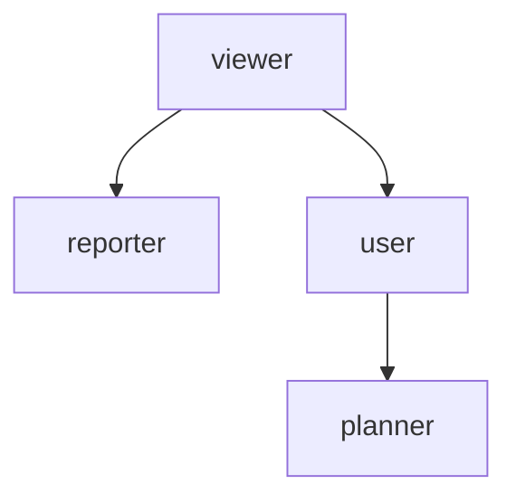

---
aliases:
  - roles
---
## paradigm
We use user roles to manage table-wise permissions and sort our users accordingly. For example,

|                   |                                                          |
|-------------------|----------------------------------------------------------|
| `tester_mnmdb`    | *(testing)*                                              |
| `viewer_mnmdb`    | read-only                                                |
| `reporter_mnmdb`  | read-only, reporting purposes (i.e. with archive tables) |
| `user_loceval`    | standard user of `locevaldb` (inbound data)              |
| `planner_loceval` | extra permissions on outbound tables                     |
| `user_gwdb`       | standard user of the `mnmgwdb` (inbound data)            |
| `planner_gwdb`    | extra permissions on outbound tables                     |


*These roles are no reflection of status or hierarchy: they are safety measures, purely technical, designed to prevent accidental change of data.*


> [!paradigm] Our design paradigm is simple:
> **users** are personalized login roles, **roles** are "groups" which define table permissions.


The `\du` shorthand lists existing roles.
Details are available via `SELECT * FROM pg_roles WHERE rolcanlogin;`.

More info can be found in the [pg documentation](https://www.postgresql.org/docs/current/database-roles.html).

## permission waterfall
Permissions are inherited, and so we design those for maximum overlap.
Per database, there are 
- `viewer`s (special case: `reporter` can access archive schema)
- `user`s are viewers with additional `UPDATE` permissions for inbound tables.
- `planner`s can also modify outbound tables (on top of their `user`-inherited permissions).


The strategy is to grant permissions as upstream as possible, but as downstream as necessary. 
If carefully applied, this avoids redundancy while retaining strict/conservative permission settings.

These "role classes" extend over databases: `viewer` is general enough to give all downstream roles view access to their non-native databases.


## administration

> [!warning] server-wide scope
> Roles are attributed server-wide (user level attributes), spanning across database mirrors.

To modify user roles, the following syntax applies.

```sql
CREATE ROLE <role>;
GRANT <role> TO <user1>, <user2>;
REVOKE <role> FROM <user1>, <user2>;
DROP ROLE <role>;
```

Permissions of the roles are then granted as follows:

```sql
GRANT SELECT ON "outbound"."MHQSafety" TO mnmdb_viewer;
REVOKE ALL PRIVILEGES ON "outbound"."MHQSafety" FROM loceval_user;
```

> [!question] granting
> It seems that permissions are distributed upon the `GRANT` command.
> Users added afterwards might not correctly receive the access rights. (Or so it seems...)