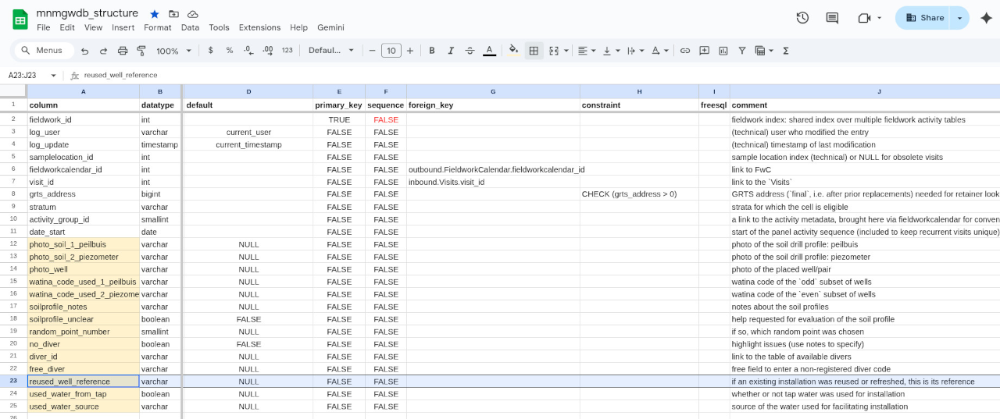
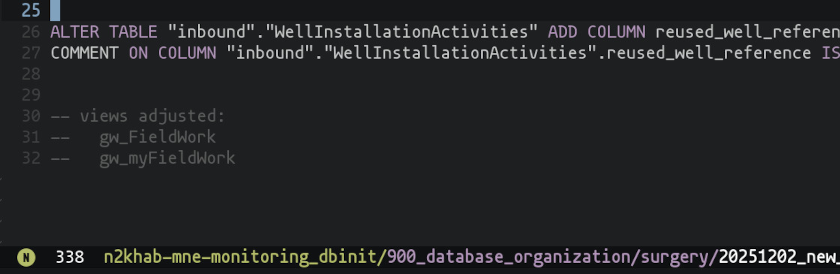

alias:: new column
tags:: examples

- *The steps below are used to create a new column. They are not the only possible way, steps can be skipped, but the extensive procedural example is supposed to help remembering all required adjustments.*
- the "database initialization" (dbinit) folder is `<project>/900_database_organization`.
- #### (1) add the new column to the [[database/structure]] google sheets.
	- Make sure to specify datatype, default value (new columns should allow `NULL` at first), and add a comment.
	- 
	- Afterwards, download the spreadsheet as an `.ods` file to the database initialization folder.
	  Make sure to set the correct users in the "chief" spreadsheet.
- #### (2) Dry-run database structure creation.
	- run the database initialization python script in the dbinit folder, after activating the virtual environment (meer over `venv` in de [INBO ICT intranet Python tutorial](https://ict-intranet.inbo.be/tutorials/software/Python.html)).
	  ```sh
	  # you would first want to git clone // cd to <project folder>
	  # pip install --upgrade -r python_requirements.txt
	  source .dbinit/bin/activate # (on Windows, use script in `.\Scripts\` subfolder)
	  ```
	- In the respective script (`110_init_loceval.py` or `210_init_mnmgwdb.py`), activate recreation of the `dev` mirror.
	  
	- Run the script, but **redirect**/dump the output to a text file (see [here](https://helpdeskgeek.com/redirect-output-from-command-line-to-text-file/), you can also use [the `tee` command](https://man7.org/linux/man-pages/man1/tee.1.html)).
	  ```sh
	  # source .dbinit/bin/activate
	  python 210_init_mnmgwdb.py > dump.txt
	  ```
	- Find and copy *all* occurrences related to the new database field from the dump file.
	  
	- Log of all your actions in a `<dbinit>/surgery` file.
	  
	- Read and understand the [[SQL]] statement. Make sure it is correct. Double check the data type, constraints, indices/keys.
- #### (3) Adjust Views.
	- Adjust the required script files in `<dbinit>/views`.
	- Make sure to also append the *update rules*!
	  
	- There are derived views: views built on views (e.g. `MyFieldWork` is a filtered view to `FieldWork`). Remember that these get auto-dropped if you drop-update the upstream view.
	  
	- Also copy the corrected view to the database structure file, sheet `VIEWS`.
	  
- #### (4) Apply the changes to a test mirror.
	- (either `-testing`, or `-staging`)
	- Connect to the server:
	  ```sh
	  psql -U <adminrole> -h <host> -p <port> -d mnmgwdb_<mirror>
	  ```
	- Create the column.
	  ```sql
	  ALTER TABLE "inbound"."WellInstallationActivities" ADD COLUMN reused_well_reference varchar;
	  COMMENT ON COLUMN "inbound"."WellInstallationActivities".reused_well_reference IS E'if an existing installation was reused or refreshed, this is its reference';
	  ```
	- Update the View and derived Views.
- #### (5) Test qgis.
	- You might want to copy your qgis project and link it to another mirror; use [[software/qgis]] / ((692eb7de-7131-4302-b3f2-d2aa1c826212)).
	- Add the new field to its place in the field form.
	  
	- Test it.
- #### (6) Apply the changes to production.
	- Just as the previous steps, but on the actual mirror.
	- Save and distribute the qgis project.
	- Export and distribute a qfield project.
	- Inform colleagues via mail.
