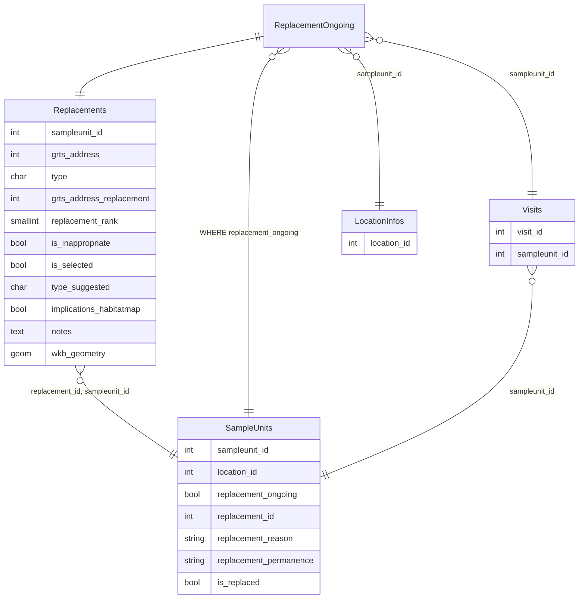

---
aliases:
  - replacement
tags:
  - loceval
---
> [!note] Local Replacement
> *Local replacement*  refers to the location evaluation procedure of selecting a proximal GRTS cell as replacement for a target sample unit which does not contain the targeted habitat type.

To enable a "local replacement", the following database objects are relevant.
`ReplacementOngoing` is a [[sql/views|view]] which only shows Replacements for the currently tagged `SampleUnits`.

