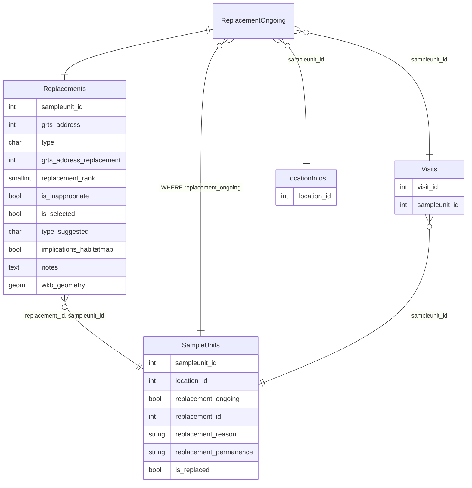

---
aliases:
  - replacement
tags:
  - loceval
---
> [!note] Local Replacement
> *Local replacement*  refers to the location evaluation procedure of selecting a proximal GRTS cell as replacement for a target sample unit which does not contain the targeted habitat type.
> Local replacement can happen repeatedly if a chosen replacement evolves into different habitat types; re-replacement must always start back from the original sample unit.

(*cf.* [[glossary/GRTS address|GRTS address]], [[glossary/habitat type and stratum|habitat type and stratum]])

To enable a "local replacement", the following database objects are relevant.
`ReplacementOngoing` is a [[sql/views|view]] which only shows Replacements for the currently tagged `SampleUnits`.

```mermaid
erDiagram
  Replacements }o--|| SampleUnits : "replacement_id, sampleunit_id"
  ReplacementOngoing }o--|| SampleUnits : "WHERE replacement_ongoing"
  ReplacementOngoing ||--|| Replacements : ""
  ReplacementOngoing }o--|| Visits : "sampleunit_id"
  ReplacementOngoing }o--|| LocationInfos : "sampleunit_id"
  Visits }o--|| SampleUnits : "sampleunit_id"
  SampleUnits {
    int sampleunit_id
    int location_id
    bool replacement_ongoing
    int replacement_id
    string replacement_reason
    string replacement_permanence
    bool is_replaced
  }
  Replacements {
    int sampleunit_id
    int grts_address
    char type
    int grts_address_replacement
    smallint replacement_rank
    bool is_inappropriate
    bool is_selected
    char type_suggested
    bool implications_habitatmap
    text notes
    geom wkb_geometry
  }  
  LocationInfos {
    int location_id
  }  
  Visits {
    int visit_id
    int sampleunit_id
  }  
  ReplacementOngoing {    
  }
    
```

